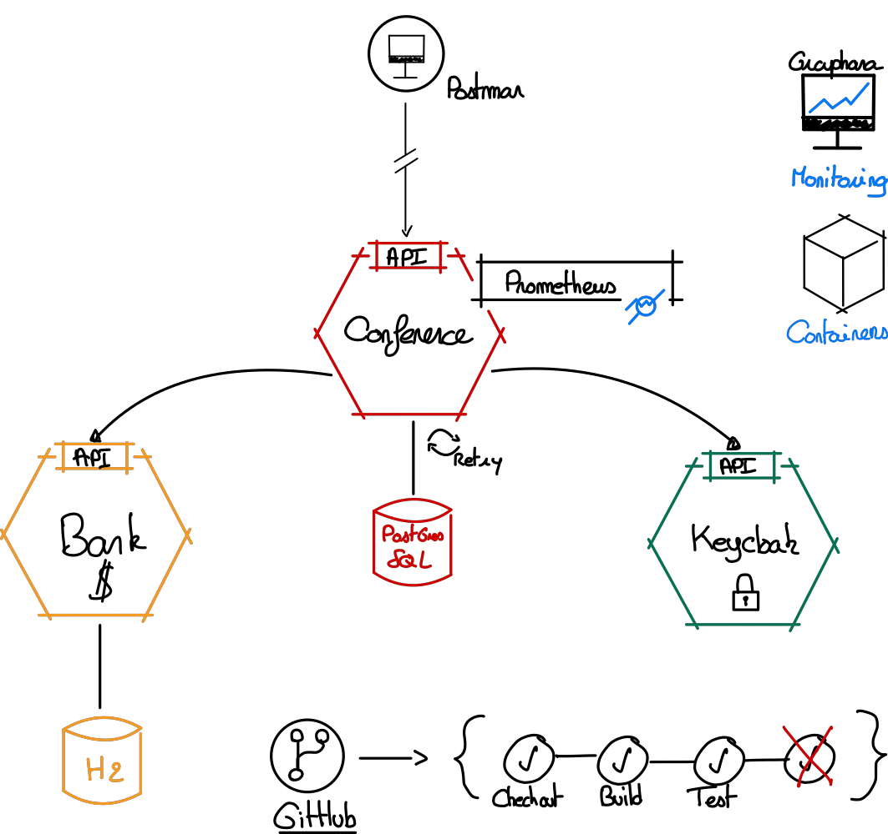
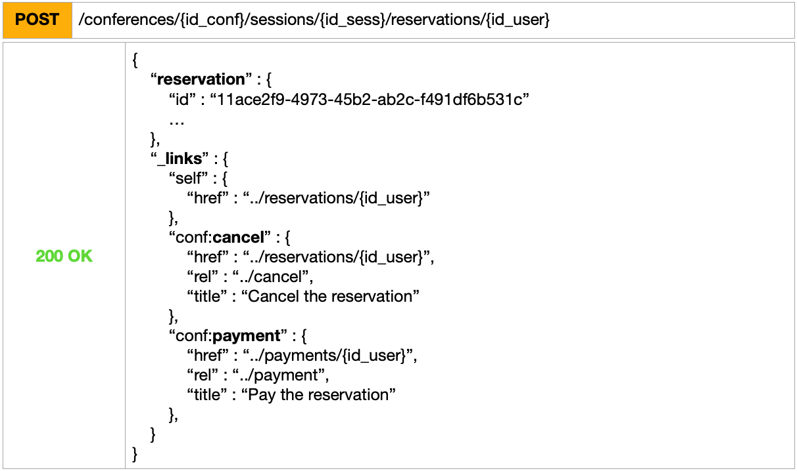
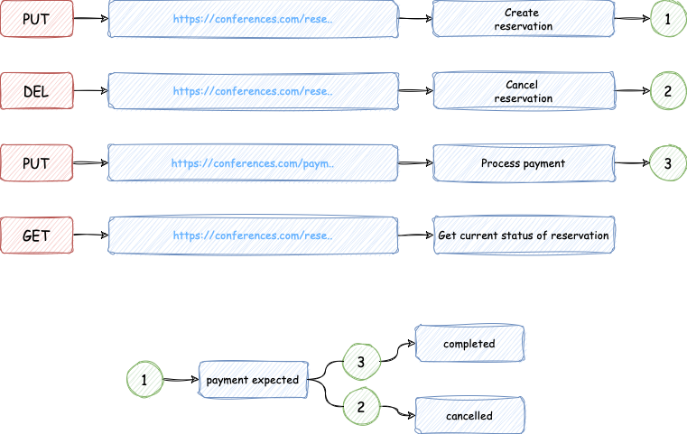
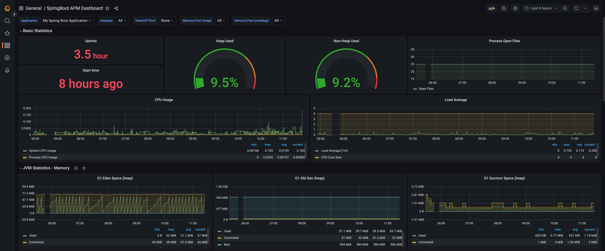

<a name="readme-top"></a>
[![Issues][issues-shield]][issues-url]
[![Workflow][workflow-shield]][workflow-url]
[![LinkedIn][linkedin-shield]][linkedin-url]


<!-- PROJECT LOGO -->
<br />
<div align="center">
  <a href="https://github.com/Benv547/m2-conference">
    
  </a>

<h3 align="center">Conférence API</h3>

  <p align="center">
    Une API de gestion de conférences
    <br />
    <br />
    <a href="https://github.com/Benv547/m2-conference/issues">Report Bug</a>
    ·
    <a href="https://github.com/Benv547/m2-conference/issues">Request Feature</a>
  </p>
</div>

<!-- A PROPOS -->
## A propos du projet


Dans le cadre de notre formation M2 MIAGE, nous avons eu pour projet de créer une API de gestion de conférences.

Ce projet est composée de 2 services :
- un service d'une banque qui permet de gérer les paiements,
- un service de gestion des conférences.

Voici les **users-stories** qui ont été définies :
- En tant qu'utilisateur, je veux **pouvoir m'inscrire** afin d'être reconnu par le système.
- En tant qu'utilisateur, je veux **pouvoir faire une recherche** de toutes ses sessions de la conférence, afin de pouvoir choisir la ou les sessions qui m'intéressent.
- En tant qu'utilisateur, je veux **pouvoir faire une recherche** en séléctionnant une session, afin de savoir s'il reste de la place.
- En tant qu'utilisateur, je veux **sélectionner**, à l'issue de ma recherche, une session afin de pouvoir m'inscrire.
- En tant qu'utilisateur, je veux **réserver** la session et **payer**.

Pour mener à bien ce projet, nous devons créer une **API RESTful** (_HATEOAS_) qui permettra de gérer les conférences.

### Architecture

Tout d'abord, voici l'**architecture** de notre projet :



Il a été demandé que notre projet doit être composé d'au moins **2 services**, l'un pour **l'API principale** et l'autre pour la **banque**.

Pour ce faire, nous avons mit en place des conteuneurs **Docker** pour pouvoir lancer et configurer nos services facilement.
Aussi, nous avons mit en place un environnement d'**intégration continue** avec **GitHub Actions** pour pouvoir tester notre projet à chaque **merge request**.
Enfin, nous avons régulièrement passé le projet sous SonarQube pour vérifier la **qualité du code**.

Pour simuler les actions de l'utilisateur sur notre API, nous avons mis en place **Postman** qui nous permet de faire des requêtes HTTP sur l'API.

En ce qui concerne l'**architecture interne** de notre API principale, elle se décompose en 5 services :
- **KeycloakService** : pour configurer Keycloak et gérer les utilisateurs,
- **ConferenceService** : pour gérer les conférences,
- **SessionService** : pour gérer les sessions,
- **ReservationService** : pour gérer les réservations,
- **BankService** : pour gérer les paiements.


### Design de l'API

Pour les routes, nous avons décidé d'**empiler les ressources** afin de pouvoir faire des requêtes plus précises et sécurisées comme ci-dessous :




#### HATEOAS

Pour que notre API soit **RESTful**, nous avons mis en place le principe de **HATEOAS** (_Hypermedia as the Engine of Application State_).

Le **schema ci-dessous** représente un exemple d'actions sucessives que peut faire un utilisateur sur notre API :



Une fois que notre utilisateur a **réserver** une session, il peut soit **payer** ou **annuler** sa réservation.

Ce principe est également appliqué sur les **sessions** qui renvoient vers la création d'une réservation mais également au niveau de la **banque** au moment de la création d'un compte pour le ravitailler.

### Les technologies utilisées

Nous avons utilisé le langage de programmation **Java** avec le framework **Spring** pour concevoir le coeur de notre application.</br>
[![Java][Java]][Java-url]
[![Spring][Spring.io]][Spring-url]

Pour gérer l'**authentification**, nous avons utilisé **Keycloak**.</br>
[![Keycloak][Keycloak]][Keycloak-url]

Pour gérer les **bases de données**, nous avons utilisé **PostgreSQL** (_API Conférences_) et **h2** (_API Banque_).</br>
[![PostgreSQL][PostgreSQL]][PostgreSQL-url]
[![h2][h2]][h2-url]

Pour gérer l'**intégration continue**, la **qualité du code** et la **dockerisation**, nous avons utilisé **GitHub Actions**, **SonarQube** et **Docker**.</br>
[![GitHub Actions][GitHub Actions]][GitHub Actions-url]
[![Docker][Docker]][Docker-url]
[![SonarQube][SonarQube]][SonarQube-url]

Pour gérer les **tests**, nous avons utilisé **JUnit** et **Mockito**.</br>
[![JUnit][JUnit]][JUnit-url]
[![Mockito][Mockito]][Mockito-url]

Pour gérer le **monitoring**, nous avons utilisé **Grafana** et **Prometheus**.</br>
[![Graphana][Graphana]][Graphana-url]
[![Prometheus][Prometheus]][Prometheus-url]

<p align="right">(<a href="#readme-top">back to top</a>)</p>


<!-- Pour bien démarrer -->
## Pour bien démarrer

Voici les instructions pour pouvoir lancer notre projet en local.
Attention, le projet est composé de sous-modules git, pensez à vérifier que vous avez l'entièreté du projet en local.

### Version avec docker-compose

#### Prérequis

- Docker
- Docker-compose

#### Installation

1. Cloner le repo
   ```sh
    git clone --recurse-submodules git@github.com:Benv547/m2-conference.git
    ```
   
2. Lancer le projet
   ```sh
   docker-compose up
   ```

### Version sans docker-compose

#### Prérequis

- Docker (ou Keycloak et PostgreSQL)
- Java 17
- Maven

#### Installation

1. Cloner le repo
   ```sh
    git clone --recurse-submodules git@github.com:Benv547/m2-conference.git
    ```
   
2. Lancer **Keycloak**

   Pour facilité la configuration de Keycloak, nous avons mis en place un fichier **.json** qui permet de créer un **realm**, ses **roles** et un **client** qu'il vous suffit d'importer dans Keycloak.

3. Lancer **PostgreSQL**

   Votre base de données doit être nommée **conference** et votre utilisateur **postgres** doit avoir le mot de passe **postgres**. Il est possible de modifier ces paramètres dans le fichier **application.properties** du module principal.

4. **Installer** les dépendances pour **chaque sous-module**
   ```sh
   mvn install
   ```

5. **Lancer chaque sous-module**
   ```sh
    mvn spring-boot:run
    ```
   
Il est possible d'ajouter une instance de **Graphana** et **Prometheus** pour pouvoir visualiser les métriques de nos services.

<p align="right">(<a href="#readme-top">back to top</a>)</p>

<!-- USAGE EXAMPLES -->
## Usage

Nous avons mis en place un **Postman** qui permet de faire des requêtes HTTP sur notre API, un fichier **.json** est disponible dans le dossier **/postman**.

### Monitoring

Pour visualiser les métriques de nos services, vous pouvez lancer **Graphana** sur le port **3002** et obtenir les données de **Prometheus** sur le port **9090**.



<!-- MARKDOWN LINKS & IMAGES -->
<!-- https://www.markdownguide.org/basic-syntax/#reference-style-links -->
[issues-shield]: https://img.shields.io/github/issues/othneildrew/Best-README-Template.svg?style=for-the-badge
[issues-url]: https://github.com/Benv547/m2-conference/issues
[workflow-shield]: https://img.shields.io/github/actions/workflow/status/Benv547/m2-conference-api/maven-build-test.yml?branch=main&style=for-the-badge
[workflow-url]: https://github.com/Benv547/m2-conference-api/actions
[linkedin-shield]: https://img.shields.io/badge/-LinkedIn-black.svg?style=for-the-badge&logo=linkedin&colorB=555
[linkedin-url]: https://www.linkedin.com/in/benjaminvignot
[Java]: https://img.shields.io/badge/Java-ED8B00?style=for-the-badge&logo=java&logoColor=white
[Java-url]: https://www.java.com/fr/
[Spring.io]: https://img.shields.io/badge/Spring-6DB33F?style=for-the-badge&logo=spring&logoColor=white
[Spring-url]: https://spring.io/
[Keycloak]: https://img.shields.io/badge/Keycloak-000000?style=for-the-badge&logo=keycloak&logoColor=white
[Keycloak-url]: https://www.keycloak.org/
[PostgreSQL]: https://img.shields.io/badge/PostgreSQL-316192?style=for-the-badge&logo=postgresql&logoColor=white
[PostgreSQL-url]: https://www.postgresql.org/
[Docker]: https://img.shields.io/badge/Docker-2CA5E0?style=for-the-badge&logo=docker&logoColor=white
[Docker-url]: https://www.docker.com/
[Graphana]: https://img.shields.io/badge/Graphana-F46800?style=for-the-badge&logo=grafana&logoColor=white
[Graphana-url]: https://grafana.com/
[Prometheus]: https://img.shields.io/badge/Prometheus-E6522C?style=for-the-badge&logo=prometheus&logoColor=white
[Prometheus-url]: https://prometheus.io/
[h2]: https://img.shields.io/badge/h2-2CA5E0?style=for-the-badge&logo=h2&logoColor=white
[h2-url]: https://www.h2database.com/html/main.html
[GitHub Actions]: https://img.shields.io/badge/GitHub_Actions-2088FF?style=for-the-badge&logo=github-actions&logoColor=white
[GitHub Actions-url]: https://github.com/features/actions
[JUnit]: https://img.shields.io/badge/JUnit-25A162?style=for-the-badge&logo=junit5&logoColor=white
[JUnit-url]: https://junit.org/junit5/
[Mockito]: https://img.shields.io/badge/Mockito-25A162?style=for-the-badge&logo=mockito&logoColor=white
[Mockito-url]: https://site.mockito.org/
[SonarQube]: https://img.shields.io/badge/SonarQube-4E9BCD?style=for-the-badge&logo=sonarqube&logoColor=white
[SonarQube-url]: https://www.sonarqube.org/
